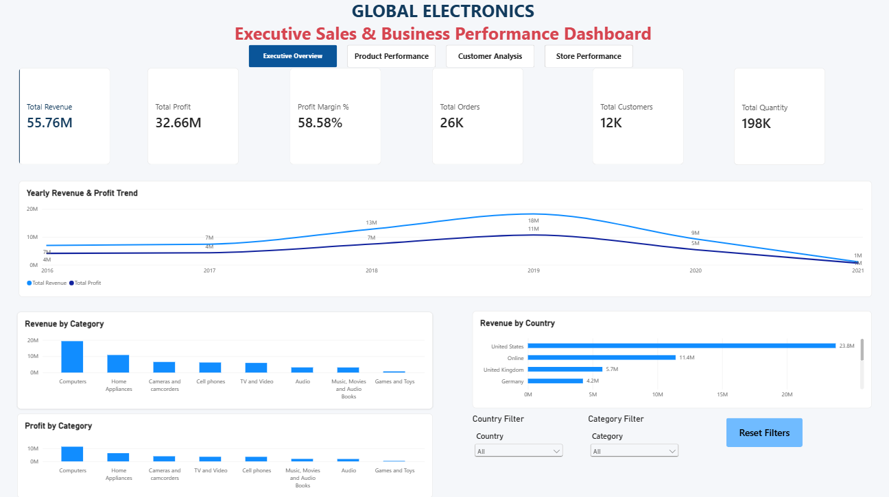
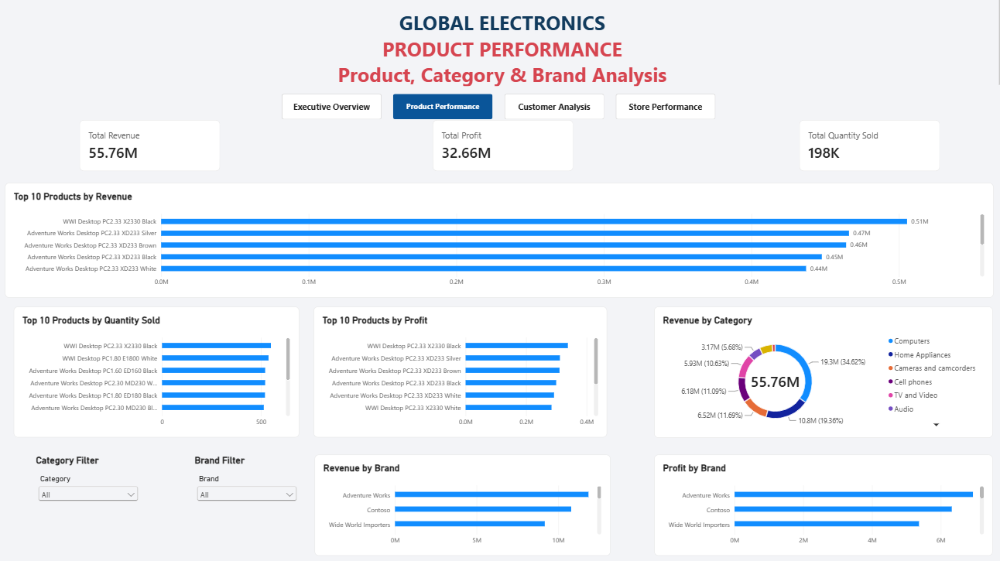
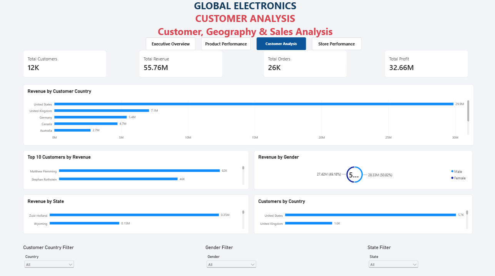
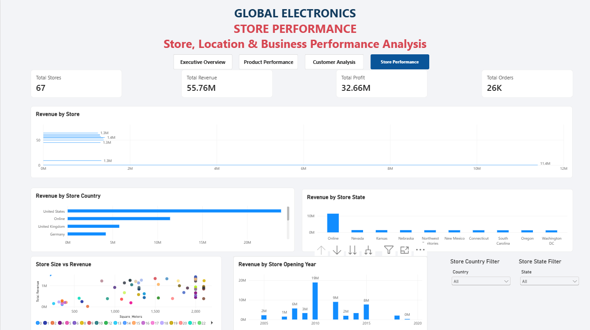

📊 Global Electronics Sales & Business Performance Dashboard

An interactive **Sales and Business Performance Dashboard** built using **MySQL, Microsoft Power BI, and DAX** to analyze sales revenue, profitability, products, customers, and store performance.

This project transforms the Global Electronics Retailer dataset into business insights through SQL analysis, data modeling, DAX measures, and interactive Power BI dashboards.

---

## 📌 Table of Contents

- [Project Overview](#-project-overview)
- [Business Problem](#-business-problem)
- [Project Objectives](#-project-objectives)
- [Tools and Technologies](#-tools-and-technologies)
- [Dataset Description](#-dataset-description)
- [Project Workflow](#-project-workflow)
- [Database and Data Model](#-database-and-data-model)
- [SQL Business Analysis](#-sql-business-analysis)
- [Power BI Dashboard Pages](#-power-bi-dashboard-pages)
- [DAX Measures](#-dax-measures)
- [Key Business Insights](#-key-business-insights)
- [Dashboard Screenshots](#-dashboard-screenshots)
- [Project Structure](#-project-structure)
- [How to Use This Project](#-how-to-use-this-project)
- [Skills Demonstrated](#-skills-demonstrated)
- [Future Improvements](#-future-improvements)
- [Author](#-author)

---

## 📖 Project Overview

The Global Electronics Sales & Business Performance Dashboard is a data analytics project designed to help users understand business performance through interactive visualizations.

The project uses retail sales data to analyze:

- Total revenue and profit
- Profit margin
- Sales quantity and order volume
- Product and category performance
- Brand performance
- Customer demographics and geography
- Store performance and location
- Store size and opening year

The data is imported into MySQL for database management and SQL analysis. Power BI is then used to create data models, DAX measures, interactive charts, KPI cards, and dashboard navigation.

The dashboard contains four main pages:

1. Executive Overview
2. Product Performance
3. Customer Analysis
4. Store Performance

### Project Highlights

- MySQL database with five main tables
- SQL-based business analysis
- Power BI data modeling
- DAX measures for business KPIs
- Interactive slicers and filters
- Top 10 product and customer analysis
- Four-page interactive dashboard
- Business insights for decision-making

---

## 🎯 Business Problem

Retail businesses generate large amounts of sales data across products, customers, stores, locations, and time periods.

Without a consolidated dashboard, it can be difficult to identify:

- Which products and categories generate the most revenue
- Which brands contribute most to profitability
- Which countries and states perform well
- Which customers contribute the highest revenue
- How sales and profit change over time
- How store locations and characteristics relate to performance

The objective of this project is to organize retail sales data and present meaningful business information through SQL analysis and interactive Power BI visualizations.

---

## 🚀 Project Objectives

The main objectives are:

1. Import and organize retail datasets in MySQL.
2. Validate the imported data using SQL queries.
3. Perform sales, revenue, cost, and profit analysis.
4. Build a relational data model in Power BI.
5. Create DAX measures for important business KPIs.
6. Develop interactive dashboards for different business areas.
7. Identify useful patterns in product, customer, and store performance.
8. Present findings in a professional, portfolio-ready format.

---

## 🛠️ Tools and Technologies

| Tool / Technology | Purpose |
|---|---|
| MySQL 8.0 | Database creation, data storage, and SQL analysis |
| Microsoft Power BI Desktop | Interactive dashboard development |
| DAX | KPI calculations and business measures |
| Power Query | Data preparation and transformation when required |
| CSV | Source data format |
| Git and GitHub | Version control and project portfolio |
| Microsoft PowerPoint | Project documentation and presentation |

---

## 📂 Dataset Description

This project uses the **Global Electronics Retailer** dataset.

The dataset contains five main business tables.

Sales (Fact Table): 62,884 records

Customers (Dimension): 15,266 records

Products (Dimension): 2,517 records

Stores (Dimension): 67 records

Exchange_Rates (Lookup Table): 11,215 records
The dataset includes customer, product, store, exchange-rate, and sales information.

### Main Data Fields

**Customers**
- CustomerKey
- Gender
- Name
- City
- State
- Country
- Continent
- Birthday

**Products**
- ProductKey
- Product Name
- Brand
- Color
- Unit Cost USD
- Unit Price USD
- Subcategory
- Category

**Stores**
- StoreKey
- Country
- State
- Square Meters
- Open Date

**Exchange Rates**
- Date
- Currency
- Exchange

**Sales**
- Order Number
- Line Item
- Order Date
- Delivery Date
- CustomerKey
- StoreKey
- ProductKey
- Quantity
- Currency Code

### Dataset Notes

- The sales data covers January 2016 to February 2021.
- The Sales table contains 62,884 transaction-line records.
- The combination of `Order Number` and `Line Item` identifies a sales line.
- Some sales records have missing delivery dates.
- The Stores table contains 67 store records, while 58 distinct stores are referenced in the Sales table.

**Data source and licensing:** Check the original dataset's source and license before redistributing the raw CSV files. This repository is intended to contain the project code, documentation, and dashboard screenshots unless redistribution of the dataset is permitted.

---

## 🔄 Project Workflow

The project follows this workflow:

1. **Data Collection**  
   Obtain the Global Electronics Retailer dataset in CSV format.

2. **Database Setup**  
   Create the `global_electronics` database and the five main tables in MySQL.

3. **Data Import**  
   Import Customers, Products, Stores, Exchange Rates, and Sales data.

4. **Data Validation**  
   Check row counts, date values, missing data, and key fields.

5. **SQL Analysis**  
   Perform business analysis using SQL queries.

6. **Power BI Connection**  
   Load the relevant tables into Power BI Desktop.

7. **Data Modeling**  
   Establish relationships between sales and the related dimension tables.

8. **DAX Measures**  
   Create measures for revenue, cost, profit, profit margin, customers, orders, and quantity.

9. **Dashboard Development**  
   Build four interactive dashboard pages.

10. **Validation and Formatting**  
    Check calculations, chart titles, filters, number formatting, and navigation.

11. **Documentation**  
    Prepare the README, dashboard screenshots, and project presentation.

---

## 🗄️ Database and Data Model

The MySQL database used in this project is:

`global_electronics`

### Main Tables

- `customers`
- `products`
- `stores`
- `exchange_rates`
- `sales`

### Data Model Overview

The Sales table is the central transaction table.

It connects to the customer, product, and store tables through their corresponding keys.

```text
                  Customers
                      |
                  CustomerKey
                      |
Products ----------- Sales ----------- Stores
ProductKey       Order Number         StoreKey
                 Line Item
                      |
                      |
                Exchange Rates
             Date and Currency
```

**Note:** This is a conceptual illustration. The exact relationships in Power BI should be verified in Model view. Exchange-rate conversion requires matching the transaction date and currency code to the corresponding exchange-rate record.

### Important Modeling Considerations

- Use appropriate data types for dates, numbers, and text.
- Use unique keys for dimension tables.
- Check for duplicate keys before establishing relationships.
- Use one-to-many relationships where appropriate.
- Verify relationship directions and filter behavior.
- Confirm that each KPI responds correctly to the intended slicers.

---

## 🔍 SQL Business Analysis

MySQL was used to organize the data and perform business-focused analysis.

### Main Analysis Areas

**1. Sales Analysis**
- Total transaction-line quantity
- Total number of distinct orders
- Sales activity over time
- Sales distribution by country

**2. Product Analysis**
- Revenue by product
- Revenue by category
- Quantity sold by product
- Product profitability
- Brand performance

**3. Customer Analysis**
- Number of distinct customers
- Revenue by customer country
- Top customers by revenue
- Revenue by gender
- Revenue by state

**4. Store Analysis**
- Revenue by store
- Revenue by country and state
- Store size compared with revenue
- Store performance by opening year

**5. Revenue, Cost, and Profit**
- Calculate revenue from sales quantity and product unit price.
- Calculate cost from sales quantity and product unit cost.
- Calculate profit as revenue minus cost.
- Calculate profit margin as profit divided by revenue.

SQL scripts are available in the `SQL` folder when added to this repository.

---

## 📊 Power BI Dashboard Pages

### 1. Executive Overview

Provides a high-level view of overall business performance.

**Key Performance Indicators**
- Total Revenue
- Total Profit
- Profit Margin
- Total Orders
- Total Customers
- Total Quantity Sold

**Visualizations**
- Yearly Revenue & Profit Trend
- Revenue by Category
- Revenue by Country
- Profit by Category

**Interactive Features**
- Country filter
- Category filter
- Page navigation
- Reset Filters button

### 2. Product Performance

Focuses on product, category, and brand analysis.

**Key Performance Indicators**
- Total Revenue
- Total Profit
- Total Quantity Sold

**Visualizations**
- Top 10 Products by Revenue
- Top 10 Products by Quantity Sold
- Top 10 Products by Profit
- Revenue by Category
- Revenue by Brand
- Profit by Brand

**Interactive Features**
- Category filter
- Brand filter

### 3. Customer Analysis

Provides insights into customer geography and revenue contribution.

**Key Performance Indicators**
- Total Customers
- Total Revenue
- Total Orders
- Total Profit

**Visualizations**
- Revenue by Customer Country
- Top 10 Customers by Revenue
- Revenue by Gender
- Revenue by State
- Customers by Country

**Interactive Features**
- Customer Country filter
- Gender filter
- State filter

### 4. Store Performance

Analyzes store locations and performance.

**Key Performance Indicators**
- Total Stores
- Total Revenue
- Total Profit
- Total Orders

**Visualizations**
- Revenue by Store
- Revenue by Store Country
- Revenue by Store State
- Store Size vs Revenue
- Revenue by Store Opening Year

**Interactive Features**
- Store Country filter
- Store State filter

---

## 🧮 DAX Measures

The following DAX measures were used in the project.

> **Important:** The measures below use the project’s current USD-based revenue and cost calculation approach. They multiply sales quantity by product unit price and unit cost in USD. They do not convert each transaction using the Exchange Rates table.

### 1. Total Quantity

```dax
Total Quantity =
SUM('global_electronics sales'[Quantity])
```

Calculates the total quantity recorded in the Sales table.

### 2. Total Revenue

```dax
Total Revenue =
SUMX(
    'global_electronics sales',
    'global_electronics sales'[Quantity] *
    RELATED('global_electronics products'[Unit_Price_USD])
)
```

Calculates revenue by multiplying each sales line's quantity by the related product unit price in USD.

### 3. Total Cost

```dax
Total Cost =
SUMX(
    'global_electronics sales',
    'global_electronics sales'[Quantity] *
    RELATED('global_electronics products'[Unit_Cost_USD])
)
```

Calculates the product cost associated with the recorded sales quantities.

### 4. Total Profit

```dax
Total Profit =
[Total Revenue] - [Total Cost]
```

Calculates profit as revenue minus cost.

### 5. Profit Margin %

```dax
Profit Margin % =
DIVIDE(
    [Total Profit],
    [Total Revenue],
    0
)
```

Calculates profit as a percentage of revenue. Format this measure as a percentage in Power BI.

### Additional Measures

The project also includes measures for:
- Total Customers
- Total Orders
- Total Stores

Example measure for total stores:

```dax
Total Stores =
DISTINCTCOUNT(
    'global_electronics stores'[StoreKey]
)
```

**Model note:** The DAX expressions above use the table and column names from the current Power BI model. If your model uses different names, update the expressions accordingly.

---

## 💡 Key Business Insights

The current dashboard displays the following overall KPI values in its existing model:

| KPI | Displayed Value |
|---|---:|
| Total Revenue | 55.76M |
| Total Profit | 32.66M |
| Profit Margin | 58.58% |
| Total Orders | Approximately 26K |
| Total Customers | Approximately 12K |
| Total Quantity Sold | Approximately 198K |
| Total Stores | 67 |

These are the displayed values from the current Power BI dashboard. Validate them against the final saved PBIX before presenting the project.

### Business Questions Answered

- Which product categories generate the highest revenue?
- Which products have the highest revenue, quantity sold, and profit?
- Which brands contribute most to revenue and profit?
- Which customer countries and states generate more revenue?
- Which customers contribute the highest revenue?
- How do revenue and profit change across years?
- How does store revenue vary by location?
- Is there an observable relationship between store size and revenue?

### How Businesses Can Use These Insights

The dashboard can support business users in:

- Identifying high-performing products and categories
- Comparing product and brand profitability
- Understanding customer contribution
- Comparing geographical performance
- Reviewing store-level performance
- Monitoring key sales and profit indicators

**Interpretation note:** These are analytical use cases and questions the dashboard supports. Specific recommendations should be based on verified chart results and business context.

---

## 🖼️ Dashboard Screenshots

The following screenshots show the four dashboard pages.

### 1. Executive Overview

This page presents the overall sales and profitability KPIs, yearly trends, category performance, and country-level revenue.



### 2. Product Performance

This page compares products, categories, and brands using revenue, quantity, and profit metrics.



### 3. Customer Analysis

This page explores customer revenue contribution, geography, and gender-based analysis.



### 4. Store Performance

This page compares store revenue across locations and examines store size and opening year.



---

## 📁 Project Structure

```text
global-electronics-sales-dashboard/
│
├── README.md
│
├── PowerBI/
│   └── Global_Electronics_Sales_Business_Performance_Final.pbix
│
├── SQL/
│   ├── 01_Database_Setup.sql
│   └── 02_Business_Analysis.sql
│
├── Screenshots/
│   ├── Executive_Overview.png
│   ├── Product_Performance.png
│   ├── Customer_Analysis.png
│   └── Store_Performance.png
│
└── Documentation/
    └── Global_Electronics_Dashboard_Documentation.pptx
```

This structure represents the intended repository layout. Add each file to the corresponding folder before publishing the project.

---

## ▶️ How to Use This Project

### Prerequisites

Install or prepare:

- MySQL 8.0 or a compatible MySQL version
- Microsoft Power BI Desktop
- Git, GitHub Desktop, or a browser for uploading files
- The Global Electronics Retailer dataset, obtained from an authorized source

### Step 1: Clone the Repository

After publishing the repository, copy its HTTPS clone URL from GitHub.

Run the following command in a terminal, replacing the placeholder with your repository URL:

```bash
git clone <YOUR_GITHUB_REPOSITORY_URL>
```

Open the downloaded project folder.

### Step 2: Set Up MySQL

1. Start MySQL.
2. Create the `global_electronics` database.
3. Create the five tables.
4. Obtain the source CSV files from the authorized dataset source.
5. Import the CSV files into the correct tables.
6. Run the validation and business analysis SQL scripts.

**Note:** Update local file paths in the SQL import commands to match your system. MySQL's `secure_file_priv` setting may restrict where files can be imported from.

### Step 3: Open the Power BI Report

1. Open Microsoft Power BI Desktop.
2. Open the PBIX file in the `PowerBI` folder.
3. If prompted, configure the required data-source connections.
4. Refresh the data if the original source data is available.
5. Check the model relationships and DAX measures.
6. Explore the dashboard pages and interactive filters.

The PBIX report may require the original dataset or updated data-source paths to refresh successfully.

### Step 4: Explore the Dashboard

Use the page navigator to switch between:

- Executive Overview
- Product Performance
- Customer Analysis
- Store Performance

Use the available slicers to explore the results by country, category, brand, gender, or state, depending on the page.

---

## 🧠 Skills Demonstrated

This project demonstrates practical experience in:

### SQL and Database Management
- Database and table creation
- CSV data import
- Data validation
- Aggregations and grouping
- Joins and business analysis
- Revenue, cost, and profit calculations

### Power BI
- Data loading and modeling
- Relationships between tables
- KPI cards
- Bar and column charts
- Trend analysis
- Scatter charts
- Interactive slicers
- Page navigation
- Dashboard formatting

### DAX
- `SUM`
- `SUMX`
- `RELATED`
- `DISTINCTCOUNT`
- `DIVIDE`
- Reusable measures
- Profit and profit-margin calculations

### Business and Analytical Skills
- Sales performance analysis
- Product and category analysis
- Customer analysis
- Geographic comparisons
- Store performance analysis
- KPI reporting
- Data visualization
- Business documentation

---

## 🔮 Future Improvements

Possible future enhancements include:

- Currency-aware revenue calculations using the Exchange Rates table
- Year-over-year revenue and profit growth
- Monthly sales trend analysis
- Dynamic Top N product and customer analysis
- Sales forecasting
- More advanced customer segmentation
- Drill-through report pages
- Automated data refresh
- Improved data-quality checks
- Additional business KPIs
- Power BI Service publishing, where available and appropriate

These items are potential enhancements and are not claimed as completed features.

---

## 👨‍💻 Author

**Nithish G.**

MCA Graduate | Aspiring Data Analyst

**Project:** Global Electronics Sales & Business Performance Dashboard

**Technologies:** MySQL | Power BI | DAX | SQL | Data Visualization

---

## ⭐ If You Find This Project Useful

Feel free to explore the SQL scripts, dashboard screenshots, and project documentation.

If you have suggestions for improving the dashboard or its analysis, feedback is welcome.

---
